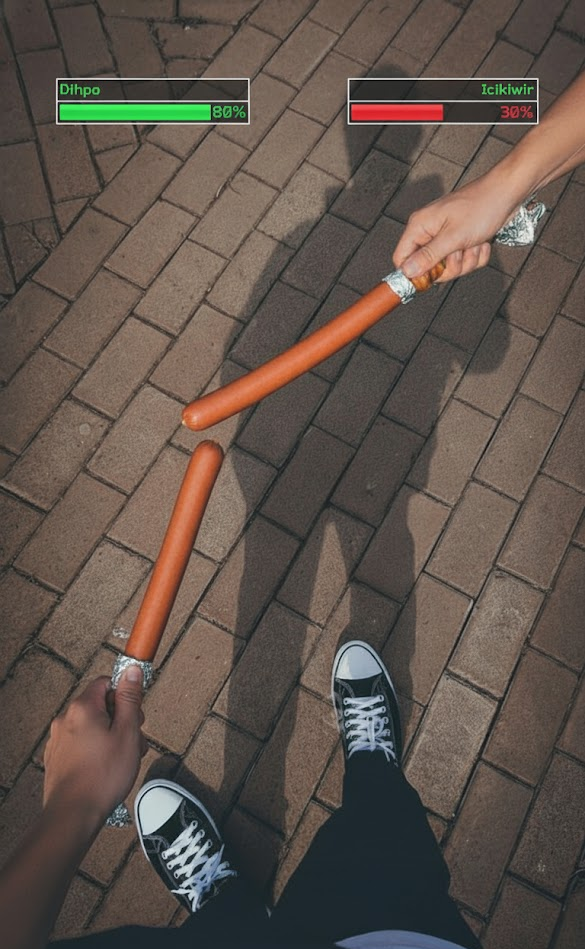
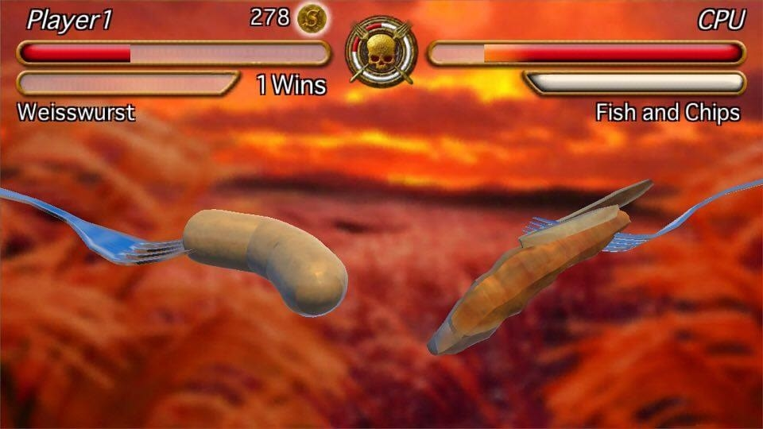
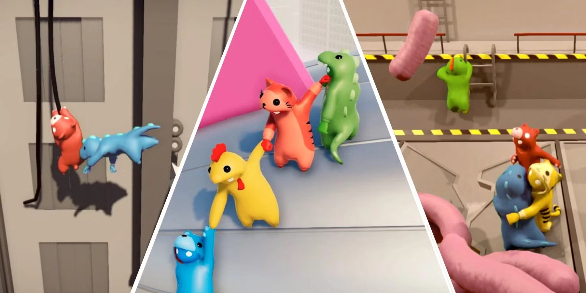

# 🌭 SOSEJ - Game Design Document

_"In Sosej, everyone's a wiener." 🌭_

**Status:** Living Document (updates ongoing)  
**Genre:** Physics-Based Fighting Game  
**Platform:** Web, Mobile-Ready  
**Target Audience:** Casual gamers, ages 10+  
**Prototype:** [https://gimcer.spuun.art/](https://gimcer.spuun.art/)

---

## 📋 Table of Contents

1. [High Concept](#-high-concept)
2. [Game Overview](#-game-overview)
3. [Core Gameplay Loop](#-core-gameplay-loop)
4. [Physics System](#️-physics-system)
5. [Character Roster](#-character-roster)
6. [Combat System](#️-combat-system)
7. [Game Modes](#-game-modes)
8. [Procedural Generation System](#-procedural-generation-system)
9. [UI/UX Design](#-uiux-design)
10. [Future Features & Roadmap](#-future-features--roadmap)
11. [Monetization Strategy](#-monetization-strategy)
12. [Appendices](#-appendices)

---

## 🎯 High Concept

**"Sosej"** is a physics-based fighting game where players control floppy sausages in competitive sausage-on-sausage combat. Using finger/hand controls, players whip their sausage's head around while the body flops realistically behind them. Victory comes from building momentum and landing devastating hits on opponents in chaotic battles.

**Elevator Pitch:**
_"Gang Beasts meets Getting Over It, but you're a sausage."_

---

## 🎮 Game Overview

### Core Philosophy

**Accessible Depth**: Easy to pick up (move your finger, move your hand), but mastery comes from understanding weight physics, momentum management, and timing.

**Emergent Comedy**: The physics system naturally creates hilarious moments without forcing humor. (Fwiw also just, sausage, in general.)

**Strategic Chaos**: While combat looks chaotic, skilled players can (and should) control momentum, predict collisions, and execute advanced techniques.

### Unique Selling Points

1. **Weight-Class Combat**: Characters feel genuinely different based on weight, not just stat changes
2. **One-Input Control**: Entire character controlled by finger/hand position
3. **Momentum-Based Damage**: No button mashing - build speed, time your strikes
4. **Procedural Sausage Generation**: Infinite character variety
5. **Cross-Platform Multiplayer**: Web-based, no downloads required

---

## 🔄 Core Gameplay Loop

### Micro Loop (Single Match)

1. **Position** → Move finger/hand to build momentum
2. **Accelerate** → Swing sausage in wide arcs
3. **Collide** → Impact opponent with high-velocity segments
4. **Adapt** → Read opponent's movement, adjust strategy
5. **Victory** → Deplete opponent's health to zero

### Macro Loop (Session)

1. **Select Character** → Choose or generate sausage
2. **Fight Match** → Complete battle
3. **Earn Rewards** → Unlock new sausages, cosmetics, arenas
4. **Upgrade/Customize** → Modify sausage appearance
5. **Rematch/Queue** → Continue playing

---

## 🕸️ Mixed Reality

We have two versions of the game, one where the 3d game is done in the usual 3d space on mobile, and one in Augmented Reality mode. In this gamemode, **8th Wall Hand Tracking** as input for the movement on the virtual 3d game.



---

## ⚙️ Physics System

### Core Physics Engine

**Verlet Integration**: Chain-based physics where each sausage segment remembers its previous position, creating realistic swinging motion.

```

Position Update:
newPosition = currentPosition + (currentPosition - previousPosition) \* damping + gravity

```

### Weight Classes

| Weight Class      | Responsiveness | Gravity Mult. | Defense | Feel              |
| ----------------- | -------------- | ------------- | ------- | ----------------- |
| **Featherweight** | 0.30           | 0.8x          | 0%      | Snappy, agile     |
| **Lightweight**   | 0.25           | 0.95x         | 5%      | Quick, responsive |
| **Middleweight**  | 0.18           | 1.0x          | 15%     | Balanced          |
| **Heavyweight**   | 0.12           | 1.3x          | 25%     | Slow, powerful    |
| **Super Heavy**   | 0.08           | 1.5x          | 30%     | Sluggish tank     |

**Responsiveness**: How quickly the head follows cursor (0.08 = lags behind, 0.30 = tight control)

### Damage Calculation

```javascript
// Base damage from velocity difference
baseDamage = (attackerVelocity - defenderVelocity) * 0.5;

// Apply attacker's damage multiplier
finalDamage = baseDamage * attackerDamageMultiplier;

// Apply defender's weight-based defense
actualDamage = finalDamage * (1 - defenderWeight * 0.3);

// Cap damage per hit
damage = min(actualDamage, MAX_DAMAGE_PER_HIT);
```

### Advanced Techniques

**Whip Crack**: Rapid direction reversal creates velocity spike  
**Helicopter**: Circular motion builds consistent speed  
**Anchor Drop**: Use gravity on heavy characters for downward strikes  
**Tail Snap**: Let body segments build momentum, then redirect head

---

## 🌭 Character Roster

### Tier 1: Starting Characters

#### 🌭 **Frankfurter** - "The All-Rounder"

- **Weight Class**: Lightweight
- **Responsiveness**: 0.25
- **Segments**: 8
- **Health**: 100
- **Damage**: 0.8x
- **Special Trait**: Quick jabs, excellent for learning
- **Strategy**: Hit-and-run tactics, maintain distance

#### 🥖 **Bratwurst** - "The Tank"

- **Weight Class**: Super Heavy
- **Responsiveness**: 0.08
- **Segments**: 10
- **Health**: 140
- **Damage**: 1.8x
- **Special Trait**: Devastating hits, hard to kill
- **Strategy**: Patient positioning, single decisive strikes

#### 🌶️ **Chorizo** - "The Speedster"

- **Weight Class**: Featherweight
- **Responsiveness**: 0.30
- **Segments**: 7
- **Health**: 85
- **Damage**: 1.0x
- **Special Trait**: Flame particle trail (visual flair)
- **Strategy**: Overwhelming speed, multiple hits

#### ⚪ **Boudin Blanc** - "The Graceful"

- **Weight Class**: Middleweight
- **Responsiveness**: 0.18
- **Segments**: 9
- **Health**: 100
- **Damage**: 1.0x
- **Special Trait**: Elegant trail effect, balanced stats
- **Strategy**: Versatile, rewards skill

#### 🔴 **Salami** - "The Tactician"

- **Weight Class**: Middleweight
- **Responsiveness**: 0.15
- **Segments**: 8
- **Health**: 110
- **Damage**: 0.9x
- **Special Trait**: Ranged sliced projectiles (click to shoot)
- **Strategy**: Zone control, keep distance

### Tier 2: Unlockable Characters (Future)

#### 🌮 **Chorizo Verde** - "The Trickster"

- Lightning-fast featherweight with teleport dash

#### 🖤 **Morcilla** - "The Vampire"

- Life-steal on hit, blood particle effects

#### 🧀 **Cheese Kransky** - "The Grappler"

- Sticky segments that grab opponents

#### 🔥 **Nduja** - "The Bomber"

- Explosive damage in radius around hits

---

## ⚔️ Combat System

### Damage Types

1. **Impact Damage**: Velocity-based collision damage
2. **Projectile Damage**: Fixed damage from thrown slices (Salami)
3. **Environmental Damage**: Stage hazards (future)

### Hit Feedback

- **Screen Shake**: Intensity scales with damage dealt
- **Yellow Flash**: Hit confirmation on damaged player
- **Damage Numbers**: Pop-up text showing exact damage
- **Particle Effects**: Character-specific (flames, sparks, etc.)
- **Sound Effects**: Meaty impact sounds, sausage squish

### Combat Flow States

```
NEUTRAL → Building momentum, no engagement
  ↓
APPROACH → Moving toward opponent
  ↓
ENGAGE → Active collision detection range
  ↓
IMPACT → Damage dealt/received
  ↓
COOLDOWN → Damage immunity frames (20 frames)
  ↓
NEUTRAL (loop)
```

---

## 🎪 Game Modes

### Current: Bot Battle

- Fight AI opponent
- Random character selection for bot
- Practice mode

### Planned Modes

#### **1v1 Duel**

- 1v1 combat
- First one to lose all health to lose

#### **Party Rumble** (3-4 players)

- Free-for-all combat
- Last sausage standing

#### **Tag Team** (2v2)

- Combo potential with teammate
- Shared health pool

#### **Survival Mode**

- Endless waves of AI opponents
- Increasing difficulty
- Unlock currency farming

#### **Custom Lobbies**

- Create private rooms
- Custom rules (damage modifiers, stage selection)
- Friend-only matches

---

### Training Modes

#### **Shadowboxing Lab**

An AI-powered training environment where players face progressively skilled opponents trained via reinforcement learning.

**Core Concept:**

- Practice against AI that learns from player strategies
- Multiple difficulty tiers based on training iterations
- Safe environment to experiment with techniques

**AI Training Approach:**

```
Method: Deep Q-Network (DQN) or similar Q-learning variant
Training Input States:
  - Player position & velocity
  - Player segment positions
  - Distance to opponent
  - Current momentum vectors
  - Health differential

Action Space:
  - Position adjustments (discretized grid)
  - Movement patterns (aggressive/defensive/neutral)

Reward Function:
  - +1.0 for successful hit
  - +0.5 for building momentum without being hit
  - -1.0 for taking damage
  - -0.2 for passive play (encourages engagement)
```

**Difficulty Tiers:**

- **Tier 1 - Floppy**: 100 training episodes (beginner-friendly)
- **Tier 2 - Skilled**: 1,000 episodes (understands momentum)
- **Tier 3 - Master**: 10,000 episodes (advanced techniques)
- **Tier 4 - AI Champion**: 50,000+ episodes (frame-perfect execution)

**Player Benefits:**

- Learn advanced techniques by observing AI strategies
- Test character matchups without pressure
- Track improvement with built-in analytics
- Unlock insights (e.g., "You're vulnerable to helicopter patterns")

---

## 🎲 Procedural Generation System

### Procedural Sausage Generator

Generate infinite unique sausages with balanced stats.

#### Generation Parameters

```javascript
// TODO: Probably gonna get revised lol, no promises
{
  // Visual
  baseColor: HSL(random),
  patternType: ['stripes', 'spots', 'gradient', 'none'],
  segmentCount: 6-12,
  thickness: 0.8-1.3,

  // Physics (balanced around target power level)
  weight: 0.2-1.0,
  responsiveness: calculateFromWeight(),
  segmentWeight: 0.8-1.5,

  // Stats (total budget: 300 points)
  health: 80-150,
  damageMultiplier: 0.7-1.9,

  // Special traits (1 per sausage)
  trait: randomFromPool()
}
```

#### Stat Balancing Algorithm

```javascript
// TODO: Probably gonna get revised lol, no promises
function generateBalancedSausage() {
  const budget = 300;

  // Distribute budget across stats
  const health = random(80, 150);
  const healthCost = health;

  const damageMultiplier = random(0.7, 1.9);
  const damageCost = damageMultiplier * 80;

  const weight = random(0.2, 1.0);
  const remainingBudget = budget - healthCost - damageCost;

  // Weight affects responsiveness inversely
  const responsiveness = lerp(0.3, 0.08, weight);

  // Ensure balanced feel
  if (weight > 0.7 && damageMultiplier < 1.2) {
    damageMultiplier += 0.3; // Heavy = more damage
  }

  return { health, damageMultiplier, weight, responsiveness };
}
```

#### Procedural Traits Pool

**Movement Traits:**

- **Rocket Boost**: Short dash in finger/hand direction (cooldown)
- **Afterimage**: Leaves trailing ghosts
- **Bouncy**: Enhanced ground bounce
- **Floaty**: Reduced gravity

**Combat Traits:**

- **Spiky**: Deal damage on contact (no velocity needed)
- **Armored**: First hit per match is nullified
- **Vampire**: Heal 20% of damage dealt
- **Explosive**: AOE damage on hit

**Utility Traits:**

- **Regeneration**: Slow health recovery
- **Slippery**: Harder to hit (smaller hitbox)
- **Magnet**: Pull nearby projectiles
- **Clone**: Spawn decoy at low health

#### Visual Procedural Generation

**Color Schemes:**

- Realistic (browns, reds, beiges)
- Fantasy (purples, blues, greens)
- Metallic (gold, silver, bronze)
- Neon (bright, saturated)

**Patterns:**

- Striped (classic sausage)
- Spotted (salami-style)
- Gradient (fade effect)
- Checkered
- Camo
- None (solid color)

**Accessories (Rare Drops):**

- Tiny hat
- Sunglasses
- Mustache
- Crown
- Bow tie
- Cape

---

## 🎨 UI/UX Design

### Visual Style

**Art Direction**: Playful, colorful, high-contrast  
**Typography**: Bangers (headings), Poppins (body)  
**Color Palette**:

- Primary: Purple gradient (#667eea → #764ba2)
- Secondary: Warm browns, reds (sausage colors)
- Accents: Yellow (hits), red (damage), green (health)

### Main Design References

1. **Sausage Legends**  
   Main inspiration, most of the mechanics are derived from this game. We're targeting a pivot to a mobile-first segmentaiton, also
   
2. **Gang Beasts**
   The FFA style is inspired from Gang Beasts and ragdoll-esque physics, with the colorful flat aesthetics we'll be borrowing from it.
   

### Screen Hierarchy

#### **Main Menu**

```
┌─────────────────────────────┐
│   🌭 SOSEJ 🌭              │
│                             │
│   [PLAY]                    │
│   [MULTIPLAYER]             │
│   [CHARACTERS]              │
│   [SHOP]                    │
│   [SETTINGS]                │
│                             │
│   Player: [Name] Lvl 12     │
│   Coins: 🪙 1,250          │
└─────────────────────────────┘
```

#### **Character Select**

- Grid layout (5 cards visible)
- Stat visualization (bars)
- 3D preview of sausage (future)
- Character lore tooltip

#### **In-Game HUD**

```
┌─────────────────────────────┐
│ [P1 Info]        [P2 Info]  │
│ 🌭 Frank         Brat 🥖   │
│ ███████░ 70%   85% ████████ │
│                             │
│        [GAME AREA]          │
│                             │
│                             │
│  🖱️ Move to flop!          │
└─────────────────────────────┘
```

---

### Analytics Events

- `match_start`: Character selections, mode
- `match_end`: Winner, duration, damage dealt
- `character_unlock`: Which character
- `purchase`: What was bought
- `matchmaking_time`: Queue duration
- `crash`: Error logs

---

## 🚀 Future Features & Roadmap

### Phase 1: MVP (Current)

- ✅ Core physics engine
- ✅ 5 unique characters
- ✅ Bot AI opponent
- ✅ Basic UI/UX
- ✅ Damage system

### Phase 2: Multiplayer

- 🔲 WebRTC implementation
- 🔲 Matchmaking system
- 🔲 Server infrastructure

### Phase 3: Content

- 🔲 Training Mode
- 🔲 5 new characters
- 🔲 Procedural sausage generator
- 🔲 Custom lobbies
- 🔲 3 new arenas

### Phase 4: Polish

- 🔲 Mobile optimization
- 🔲 Cosmetics shop
- 🔲 Improved VFX

### Phase 5: Expansion

- 🔲 Party modes (4 players)

---

## 📝 Appendices

### A: Controls Reference

**Touch (Mobile):**

- Drag finger = Control head position
- Tap = Shoot projectile (Salami only)

**Augmented Reality**

- Move hand = Control head position
- Raise Thumb = Shoot projectile (Salami only)

### B: Glossary

- **Sosej**: Sausage
- **Flop**: The physics-based swinging motion
- **Whip**: Rapid direction change for velocity
- **Tank**: High-health, low-speed character
- **Proc Gen**: Procedurally generated content

### C: Inspirations

- **Gang Beasts**: Hilarious physics combat
- **Getting Over It**: One-input control mastery
- **Stick Fight**: Simple, competitive fun
- **Totally Accurate Battle Simulator**: Emergent comedy
- **Brawlhalla**: F2P fighter done right
